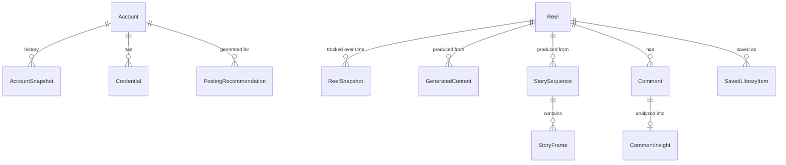

# Database Design — AI Instagram Content Studio

**Engine:** Postgres (Supabase free tier, or self-hosted via Docker) via Prisma ORM. V1 originally targeted local-first SQLite (PRD §8); switched to Postgres when the decision was made to deploy on Vercel, whose serverless filesystem can't host a SQLite file — see `docs/DEPLOYMENT.md`.

Full schema lives at `prisma/schema.prisma`; this doc explains the *why* behind each entity and the relationships.

---

## 1. Entity Overview

## 2. Entities

### `Account`

The Instagram Business/Creator account connected via Composio (PRD §7.1). One row per connected account; V1 typically has exactly one. Holds public profile fields only (username, display name, avatar) — never the token itself.

### `Credential`

The Composio OAuth token for an `Account`, stored encrypted server-side (see Architecture §7). Never joined into any API response sent to the client.

### `AccountSnapshot`

A point-in-time capture of dashboard metrics (followers, following, posts count, engagement rate) for an `Account`. Written on every dashboard refresh; the series of snapshots is what draws the growth chart. Without this table "growth over time" (PRD §6.1) has nothing to plot.

### `Reel`

A discovered or imported Reel — the core object of the Viral Content Engine. `source` (`ProviderId`) and `confidence` (`verified`/`estimated`) are always set, mirroring `ProviderResult` from the Architecture doc, so the UI's provenance badge (PRD §6.2) is never guessed at render time. `niche` is the search term it was discovered under (a Reel can be re-tagged into multiple niches over time via a join table if that turns out to matter — deferred until it does, per project conventions).

### `ReelSnapshot`

A later re-check of the same `Reel`'s metrics. Two or more snapshots are what make "Fastest Growing" sort (PRD §6.2) computable instead of guessed; a `Reel` with only one snapshot (first import) is excluded from that sort, not estimated.

### `GeneratedContent`

Output of a Reel Action (script, hook, caption, hashtags, "why it went viral", audience analysis) or of the general AI Content Generation module. One row per generation *run* (not overwritten on regenerate) so a user can compare drafts. `promptVersion` ties a row back to the exact prompt-library entry that produced it (docs/PROMPT_LIBRARY.md), which matters once prompts get tuned over time and old content needs to stay attributable to what generated it.

### `StorySequence` / `StoryFrame`

A generated story sequence is a set of ordered frames, each with its own text/visual-idea/poll/question-box/CTA/sticker fields (PRD §6.5) — modeled as parent + ordered children rather than one JSON blob, so a single frame can be regenerated/edited without touching the rest of the sequence.

### `Comment`

Either pulled live from Composio for the user's own `Reel`/post, or imported. Raw text + author, feeding `CommentInsight`.

### `CommentInsight`

The AI-analyzed output over a set of `Comment`s for one post: pain points, repeated questions, desired topics, sentiment split (PRD §6.6). Regenerable, kept as history like `GeneratedContent`.

### `PostingRecommendation`

Best days/hours/frequency plus the reasoning text, generated from an `Account`'s posting history (PRD §6.7). Tied to `Account`, not to a single Reel.

### `SavedLibraryItem`

The result of "Save to Library" (PRD §6.3) — a user-curated subset of `Reel`s, optionally with personal notes. This is also what feeds the `curated-library` discovery provider's own future entries if the user chooses to promote a saved item into the shared seed set (V1: manual export, not automatic).

### `Settings`

Single-row (V1, single local user) table: `researchModeEnabled` (the opt-in gate for the Browser Automation provider, PRD §5/§7.1), theme preference, and future per-user config. Becomes per-user once multi-tenant auth ships (PRD §9).

---

## 3. Notes on V1 Simplifications (intentional, not oversights)

- No `User`/multi-tenant tables yet — PRD §8 scopes V1 to a single local user. Adding auth later means adding a `User` table and a `userId` foreign key to `Account`, `Settings`, and `SavedLibraryItem`; the schema is written so that's an additive migration, not a redesign.
- No `Niche` entity — niche is a plain string on `Reel` for V1. Promote to its own table only if/when tagging one Reel under multiple niches or niche-level analytics is actually needed (KISS/YAGNI).
- `GeneratedContent.content` and `CommentInsight`'s list fields are stored as JSON text columns rather than normalized child tables or native `jsonb`, since they're read as a whole and never queried by sub-field in V1 — revisit as `jsonb` (Postgres has native support, unlike the SQLite this schema originally targeted) if that changes.
